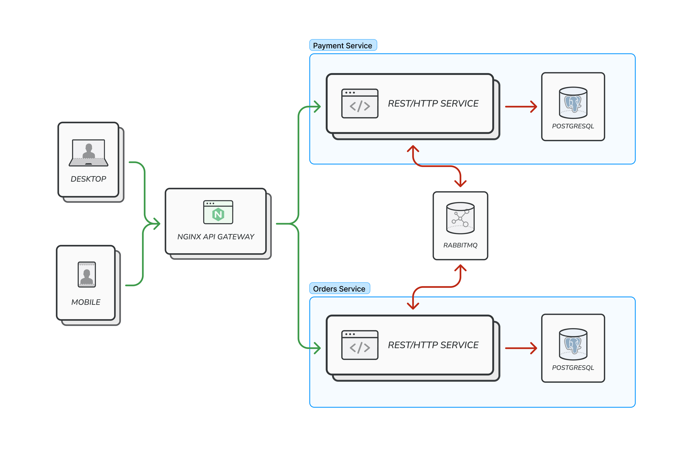

## Orders processing || Software Design

### API specification

Postman [workspace](https://www.postman.com/avtorpaka/workspace/sd-orderprocessing)

### Deployment

#### 0. Change .env.template variables if needed

| **Variable**                | **Description**                                 | **Default** |
|-----------------------------|-------------------------------------------------|-------------|
| **SD_OP_GATEWAY_PORT** | Port, forwarded to docker container with an nginx api-gateway | 7071 |
| **BUILD_ARCH**              | Your system / docker builder architecture       | arm64  |
| **BUILD_PLATFORM**          | Your system / docker builder OS                 | linux/arm64 |


#### 1. Deploy

```shell
cd SD.OrderProcessing/deploy && touch .env && cp .env.template .env && docker compose up -d
```

### Asynchronous processing

Order payment processing is an asynchronous operation that includes:

 - Transactional outbox pattern for order payment messages on Orders service side

 - Transactional inbox and outbox patterns for order payment and payment status messages on Payment service side
 - Exactly once semantics - withdrawal of order payment sum
 - CAS atomic balance update
 - Usage of RabbitMQ as message broker

### Global architecture

